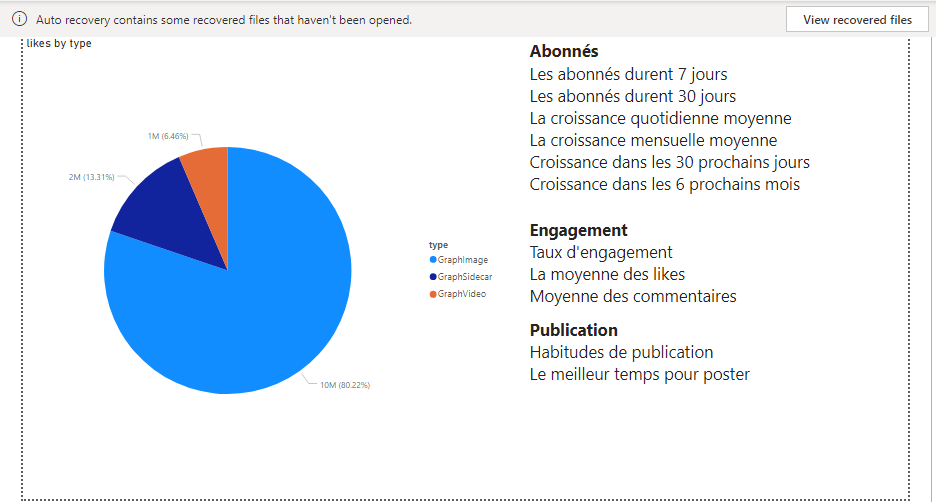

# Instagram-Data-Analysis
Hello everyone, I'm working on a project on Instagram Data Analysis (using Python and Power BI ) If you're interested in data analysis and data visualization or you already worked on similar project please contact me! I want o chat with someone interested in this project! I'm looking forward to share this small project with interested people and exchange knowledge

# My next goal is

To calculate this KPI with forecasting based on audience data 

Followers last 7 days
Followers last 30 days
Average daily growth
Average monthly growth
Growth next 30 days
Growth next 6 months

Engagement
Engagement rate
Average likes
Average comments

Posting habits
Best time to post

Types of Media

Likes insights

Scraped Data

